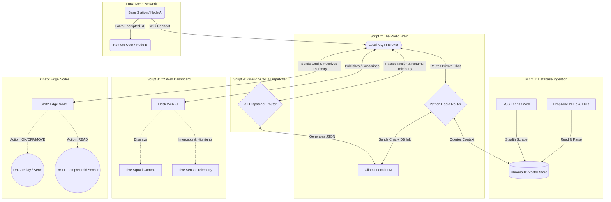

# 📻 GhostNode-AI: Off-Grid Tactical Mesh Server & Kinetic SCADA Dispatcher (LoRa / MQTT)

GhostNode-AI is a fully offline, autonomous AI "Librarian," Tactical Assistant, Command & Control (C2) Dashboard, and **Bidirectional SCADA Dispatcher** designed for Meshtastic LoRa networks.

It operates entirely independent of the internet, scraping global intelligence and reading offline manuals into a local multi-collection vector database. It broadcasts intelligent, context-aware answers over encrypted radio channels using strict transmission chunking. 

With the latest SCADA update, GhostNode bridges the gap between digital intelligence and physical hardware. You can now use natural language over the radio mesh to control local edge devices (relays, servos) and retrieve **live telemetry (temperature, humidity)** from a swarm of physical sensors using built-in debounce aggregation.


⚠️ **IMPORTANT: Running this on lower-end hardware?** The default LLM models require significant RAM/VRAM. Please read the `🧠 AI Model & Hardware Selection Guide.md` to swap to lighter models before continuing.

---

## 🧠 The Four Pillars of GhostNode-AI

This system relies on four interconnected Python engines running simultaneously:

1. **The Memory Librarian (`DropzoneChromadb_Release.py`):** Quietly builds the offline database. It utilizes stealth browser masquerading, multi-threaded worker queues, and URL deduplication to scrape RSS feeds without triggering bot-blockers. It separates data into specific collections and features a 90-day auto-pruning system.
2. **The AI Brain (`LLMconnectLora_Release.py`):** The core radio listener. When an authorized user sends a command over the mesh (e.g., `!tac What is the latest news in the US?`), it securely queries the database using mathematical distance filtering to prevent hallucinations, and broadcasts a chunked response over LoRa.
3. **The Operations Center (`WebDashboardInterface_Release.py`):** A local Flask web UI designed for a field laptop or tablet. It features split-screen comms, silent AI querying, manual radio transmission, and a **Live Telemetry Hub** that intercepts and displays returning sensor data from the hardware mesh.
4. **The Kinetic SCADA Dispatcher (`IoT_Dispatcher_Release.py`):** The hardware bridge. It intercepts natural language commands (e.g., *turn on the blue led* or *what is the temperature*), translates them into strict machine-readable JSON using a dedicated local coder LLM (`qwen2.5-coder`), and dispatches them to custom ESP32 hardware nodes. It features a "Rolling Debounce Buffer" to aggregate massive swarm telemetry reports into clean, single-message LoRa transmissions.

---

## 📻 Phase 1: Hardware & The SCADA Loop

To build this system, you must use two separate Meshtastic radios, a local MQTT Broker, and optional Edge Nodes for physical interaction.

* **The Base Station (Node A):** A dedicated radio (e.g., Heltec V3 plugged into the wall/server). Connected to local Wi-Fi, it acts solely as the AI's mouth and ears.
* **Your Personal Radio (Node B):** The radio in your pocket or tactical rig, connected to your phone.
* **The Local Broker (`E_paper_MqttBroker_Release.ino`):** A standalone MQTT server on your local network. For the ultimate tactical kit, flash this provided sketch to an **ESP32 T5 E-Paper** board for a low-power, screen-equipped portable broker. 
* **Kinetic Edge Nodes (`MqttClientwithDH11_Release.ino`):** ESP32 microcontrollers (e.g., D1 Minis) running custom GhostNode firmware wired with **DHT11 Sensors**. These nodes listen on specific MQTT topics, parse the AI's JSON, trigger real-world actions, read physical sensors, and fire JSON telemetry back to the basecamp.

---

## 🛠️ Phase 2: Software Prerequisites
Before running the Python scripts, you must install the local AI engine and download the required models.

1. Install [Ollama](https://ollama.com/) on your machine.
2. Open your terminal and download the **AI Chat Model** (Requires ~24GB RAM/VRAM for Mixtral, or use `llama3:8b` for lower-end hardware):
```bash
   ollama run dolphin-mixtral:8x7b-v2.5-q4_K_M
```

Download the Database Embedding Model:
```bash
ollama pull nomic-embed-text 
```

Download the Kinetic Dispatcher Model (Optimized for JSON generation):
 ```bash
ollama pull qwen2.5-coder:7b
```


📦 Phase 3: Python Dependencies
This project requires specific Python libraries to handle MQTT routing, database vectoring, web scraping, and the C2 Dashboard. Install them via your terminal:
 ```bash
pip install paho-mqtt requests chromadb feedparser beautifulsoup4 PyPDF2 python-dotenv flask
 ```

🔐 Phase 4: Master Configuration (.env)
GhostNode-AI is heavily customizable. DO NOT hardcode your passwords or IP addresses into the Python scripts.

Create a new text file in the same folder as your Python scripts named exactly .env.

Copy the contents of the provided example.env file into your new .env file.

Configure your specific Broker IP, Heltec Node ID, and database file paths.

Tune your AI: The .env file controls the AI's hallucination safety net (MAX_DISTANCE), the scraper's stealth level (INGEST_WORKERS), and chunk overlap limits.

Tune your Dispatcher: Define your CODER_MODEL (default: qwen2.5-coder:7b) and your LISTEN_TOPIC for hardware handoffs.

🚀 Phase 5: Launching the System
You must run the scripts in separate terminal windows.

1. Start the Memory Librarian (Database Builder)
Run this script in the background. It will automatically wake up to pull fresh intelligence. Drop any .pdf survival manuals into your Dropzone folder and use Option 1 to memorize them.

```bash
python DropzoneChromadb_Release.py
```
2. Start the AI Brain (Radio Listener)
Connects the AI to your radio mesh to answer intelligence queries.

```bash
python LLMconnectLora_Release.py
```
3. Start the Operations Center (C2 Web UI)
Launch your graphical interface and navigate to the local IP provided in the terminal.

```bash
python WebDashboardInterface_Release.py
```
4. Start the Kinetic Dispatcher (Hardware Bridge)
Launch the dual-path IoT router to enable physical hardware control via the mesh or dashboard.

```bash
python IoT_Dispatcher_Release.py
```

📡 Phase 6: Using the System
1. Database Radio Commands
Grab your personal Meshtastic radio (Node B) and send a text to your designated AI channel. The AI uses strict collection-routing to prevent cross-contamination of data:

!tac [query] -> Searches ONLY News intel. (Replies with a military SITREP).

!surv [query] -> Searches ONLY Manuals/PDFs. (Replies with rugged survival advice).

!grump [query] -> Searches ONLY Web scrapes. (Replies sarcastically).

!ai [query] -> Searches the entire database. (Direct, efficient response).

2. Kinetic SCADA Commands
Send natural language commands to interact with physical Edge Nodes. The Dispatcher will generate JSON, trigger the ESP32, and broadcast either a confirmation or live sensor data back to your radio.

Basic Kinetic Control: !action turn on the blue led on node alpha

Specific Node Telemetry: !action what is the temperature on dh11node (Replies: [SENSOR] DH11NODE TEMPERATURE: 21.4)

Swarm Telemetry: !action read the temperature on all nodes (The buffer will aggregate all replies and send: [SENSORS] ALPHA: 21.4 | BRAVO: 25.3 | CHARLIE: 19.8)

LoRa Override: Prepend lora to force a command over the RF mesh rather than local Wi-Fi: !action lora check the humidity on dh11node.

3. Operations Center Dashboard Features
Split-Screen Comms: Separates your AI Database queries (Left Panel) from Live Squad Chatter (Right Panel).

Telemetry Intercept: Automatically catches and highlights returning DHT11 sensor data in bright yellow on the C2 dashboard.

Silent Mode: Ask the AI questions and read the answers on your screen without broadcasting them over the radio and congesting the LoRa network.

Dynamic Channel Routing: Send manual human messages or broadcast AI intel to specific channels (0-5) using the dropdown menu.

Auto-Responder Intercepts: Squad mates can text !weather [City] over the radio, and the dashboard will silently fetch the internet data and broadcast the clean weather report automatically.


## 🧩 Phase 7: Modular Deployments (Microservice Architecture)

GhostNode-AI was built using a strict **Decoupled Microservice Architecture**. The Python scripts do not share memory or rely on each other's code to function—they only communicate via the MQTT Broker. 

This means you do not have to run the entire suite. You can deploy specific fragments of the GhostNode network based on your hardware capabilities and mission requirements.

### Option A: The "Kinetic-Only" SCADA Setup
Perfect for makers, off-grid smart homes, or users with lower-end hardware who don't have the RAM to run massive RAG AI models. This setup gives you full natural language control over physical hardware and bidirectional sensor telemetry.

* **Required AI:** `qwen2.5-coder:7b` (Very lightweight, runs easily on most laptops).
* **Required Scripts:** * `python IoT_Dispatcher_Release.py` (Handles the logic and LoRa chunking).
  * `python WebDashboardInterface_Release.py` (Optional: If you want the visual C2 interface).
* **Result:** You can command relays and query DHT11 swarms over your radio mesh, entirely bypassing the heavy ChromaDB and Mixtral components.

### Option B: The "Intel-Only" Librarian Setup
Perfect for users who want an offline tactical encyclopedia and situational awareness tool, but don't want to wire up physical ESP32 edge nodes.

* **Required AI:** Chat Model (e.g., `dolphin-mixtral` or `llama3`) + `nomic-embed-text`.
* **Required Scripts:**
  * `python DropzoneChromadb_Release.py` (To build your database).
  * `python LLMconnectLora_Release.py` (To answer radio queries).
  * `python WebDashboardInterface_Release.py` (Optional).
* **Result:** You get a highly intelligent, radio-accessible offline database that answers `!tac` and `!surv` queries without any of the IoT hardware overhead.


  ## ⚖️ Phase 8: Licensing & Support

**GhostNode-AI is provided under a Dual-License model.**

* **Personal & Non-Profit Use:** You are entirely free to clone, modify, and deploy this architecture for personal projects, educational research, and non-profit off-grid missions. 
* **Commercial & For-Profit Use:** If you intend to integrate GhostNode-AI (or its core architecture) into a commercial product, sell hardware pre-loaded with this software, or use it in any profit-generating environment, **a commercial license is strictly required.** Please reach out directly to arrange a commercial agreement.

### ☕ Support the Mission
GhostNode-AI was built from the ground up to push the boundaries of what is possible with off-grid local AI and Meshtastic radios. Countless hours went into the hardware testing, AI routing logic, and SCADA firmware. 

If this system has helped you secure your comms, automate your off-grid basecamp, or if you just want to support future updates and development, consider dropping a tip to the wallets below!

**Crypto Wallets:**

* **ETH:** `0x86c49BdFD27E87E4860B453d82d4251c4a35771D`
* **BTC:** `bc1qyfsfdmahpnjd40mznpg233q27fdvvxkl4rc62k`

### 📬 Contact & Inquiries

For commercial licensing, project collaborations, or just to share pictures of your GhostNode hardware builds out in the wild, you can reach out to me here:

* **Twitter / X:** [Profile](https://x.com/DigbySharples)
* **Facebook:** [Profile](https://www.facebook.com/Mr.Sinical)



